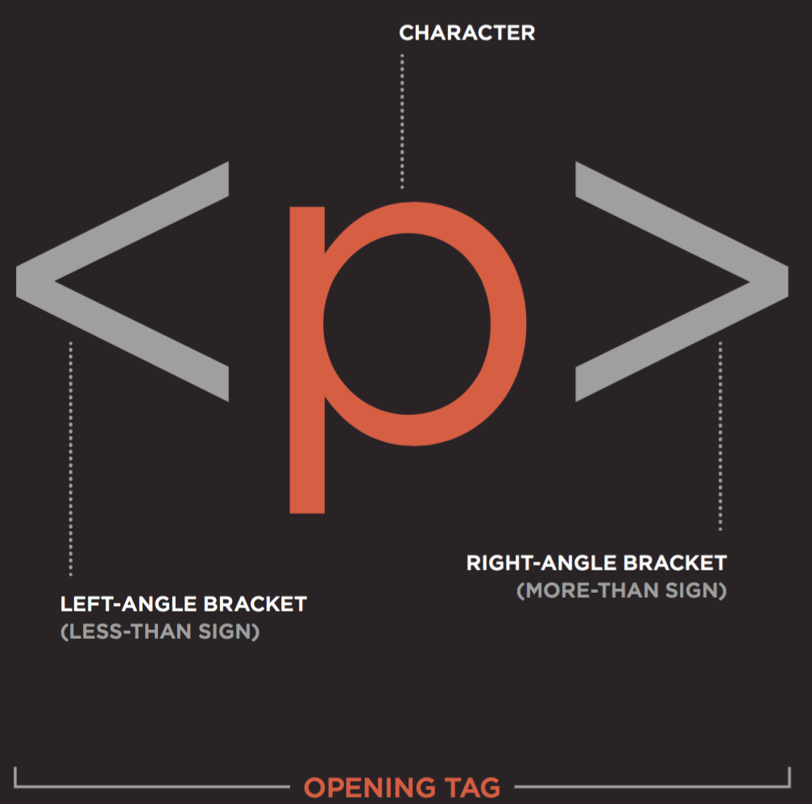
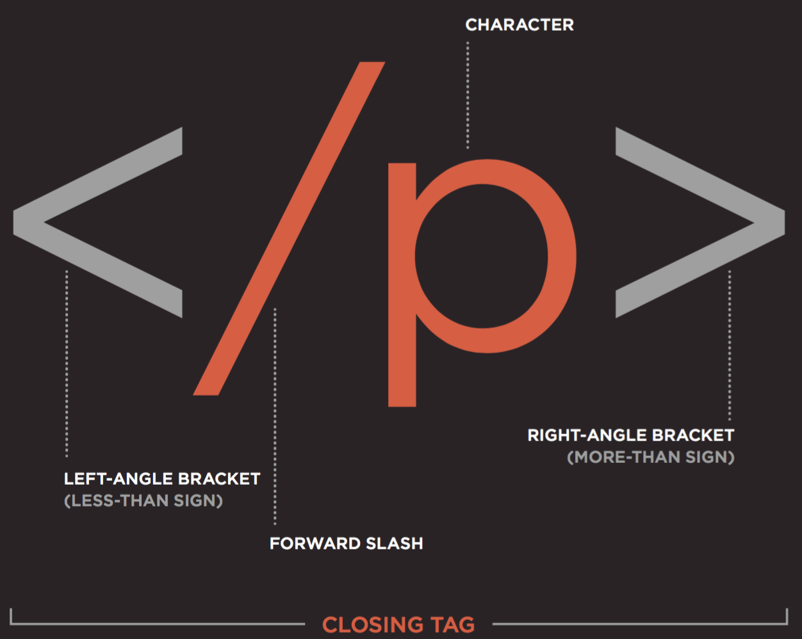

## HTML Nodes and Elements

HTML is made up of **nodes**. In fact, everything inside of HTML is a node. There are many *types* of nodes. For example, elements, text, and comments --- those are all nodes.

An element is made up of an "opening tag" and a "closing tag". Below is an example of the tags that are used for a "paragraph" or "p" element.





Below we have a "paragraph element". The element is made up of the opening tag, the text in the middle and the closing tag.

```html
<p>Hey I'm a paragraph!</p>
```

The text is actually a text node - remember everything in HTML is a node!
How many elements are in the code below? What are their tags?

```html
<div>
  <h1>All About HTML</h1>
  <p>I'm in a div and it's great.</p>
</div>
```

<details><summary>
  Click here to reveal the answer.
</summary>
There are 3 elements: A "div", and inside of it an "h1" element and next to it a "p" element.
</details>

</br>
And how many nodes are there here?

```html
<!-- I'm a comment -->
<!-- I'm pretending to be a comment -->
<div>
  <h1>All About HTML</h1>
  <p>I'm in a div and it's great.</p>
</div>
```

<details><summary>
  Click here to reveal the answer.
</summary>
Seven: three element nodes, 2 comment nodes and two text nodes
</details>