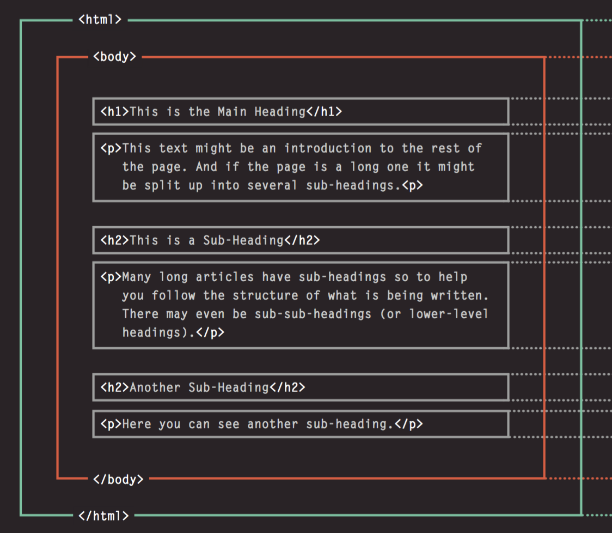

## HTML Structure

It may sound obvious but HTML is a language used for presentational purposes. Using HTML elements, you can build the physical layout of a webpage.



Copy and paste the code below inside of the **body** of your **index.html** file and then open it in your browser:

```html
<h1>This is the Main Heading</h1>
<p>This text might be an introduction to the rest of the page. And if the page is a long one it might be split up into several sub-headings.</p>

<h2>This is a Sub-Heading</h2>
<p>Many long articles have sub-headings to help you follow the structure of what is being written. There may even be sub-sub-headings (or lower-level headings).</p>

<h2>Another Sub-Heading</h2>
<p>Here you can see another sub-heading.</p>
```
Notice in the browser, how each element takes up the entire width of the page. This is because heading tags (the h1's, and h2's) and paragraph tags (the p's) are both **block-level** elements. 

In other words, **block elements take up the entire width of their parent elements** (in this case, their parent is the body tag).

Now change your HTML to look like this and open it in your browser:

```html
<h1>This is the Main Heading</h1>
<p>This text might be an introduction to the rest of the page. And if the page is a long one it might be split up into several sub-headings.</p>

<h2>This is a Sub-Heading</h2>
<p>Many long articles have sub-headings to help you follow the structure of what is being written. There may even be sub-sub-headings (or lower-level headings).</p>

<h2>Another Sub-Heading</h2>
<p>Here you can see another sub-heading. <span>Span tags are inline as you can see.</span></p>
```

Notice that our `span` tag did not take up the width of its parent. This is because span elements are **inline** and they... well, fall in line with their surrounding elements. 

In other words, **inline elements only take up as much space as they need**


