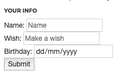

## Now You

You've got a bunch of elements. It's your time to learn through experimentation:

Make a list nested inside of a div element
Make two spans inside of a div
Display a big header with an image under it, and a subheader explaining the image
Make one of the items from the list above a link (see above about href) to a different website

Finally, create a simple form layout, it should look like this:

A few notes about the above:

- Buttons and inputs are **inline** by default
-- You can **nest** them in a `div` to make them take a new line
- See the birthday input? What `type` attribute do you reckon that is?
-- See [this](https://www.w3schools.com/tags/att_input_type.asp) if you can't figure it out

Sure, it'll all be ugly, but this is just the skeleton of a webpage. To make things prettier, you'll need some CSS.